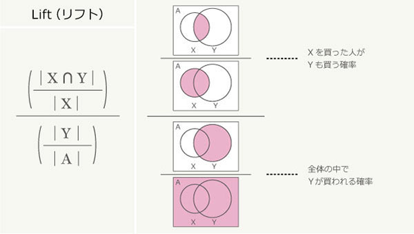

```{r setup, include=FALSE}
knitr::opts_chunk$set(echo = TRUE)
```
# Chapter 8
This is an R Markdown document about Chapter 8 of [this book](https://www.shoeisha.co.jp/book/detail/9784798143446).

## Evaluation indicator in association analysis

This is a [great reference](https://www.albert2005.co.jp/knowledge/marketing/customer_product_analysis/abc_association).

### Support

The ratio of transaction including product X and Y to all transactions.


 
### Confidence

The ratio of transaction including product X and Y to transaction of X. 


This indicator decides the direction of recommendation. 

For example, if X is printer and Y is ink cartridge,

X -> Y : reasonable recommendation

Y -> X : questionable recommendation


### Lift

The ratio of confidence to the ratio of transaction of Y to all transactions. More than 1 is considered a good recommendation rule.



## 8.3 Try arules package

```{r install package, include=FALSE}
install.packages("arules", repos = "http://cran.us.r-project.org")
library(arules)
```

```{r install dataset, include=FALSE}
data(Groceries)
#if you want to read an original file you prepare,
#Groceries <- read.transaction("Groceries.txt", format="basket", sep=",")

str(Groceries)
```

### Summary Statistics
```{r check dataset in first 6 rows}
inspect(head(Groceries))
```

```{r summary statistics}
summary(Groceries)

```

```{r histogram}
itemFrequencyPlot(Groceries, support=0.04, cex.names=0.8)# support: set threshold of support, cex.names = adjust the size of labels
```

### Apriori function
```{r apriori}
rules <- apriori(Groceries, parameter = list(support = 0.005, confidence = 0.01)) # we can set thresholds
```

If we want to get associated transactions of beef, we can find products often bought with beef by sorting the data by `lift`.
```{r beef}
beefRules <- subset(rules,subset= rhs %in% "beef")
inspect(head(sort(beefRules,by= "lift")))

```
However, based on support, the 3rd combination--{root veg} -> {beef}-- might be more insightful.


```{r save csv file}
write(beefRules, file="data.csv", sep=",", col.names=NA)
```

## 8.3 Visualize results
```{r install two packages, include=FALSE}
#install.packages("arules", repos = "http://cran.us.r-project.org")     
install.packages("arulesViz", repos = "http://cran.us.r-project.org")
#library(arules)                 
library(arulesViz)
```

```{r run algorithum}
#data(Groceries)
rules <- apriori(Groceries, parameter=list(support=0.001, confidence=0.5)) # lower thresholds than the above
```

### Scatterplot
```{r plot rule}
plot(rules)
```


### Bubble chart
```{r bubble chart, fig.height = 10, fig.width = 10}
plot(rules, method="grouped", control=list(k=30))
```

size of bubbles: support
color of bubbles: lift

### Association graph
```{r directed graph}
rules_high_lift <- head(sort(rules, by="lift"), 10) # limit the top 10
plot(rules_high_lift, method="graph",  engine='interactive')
```

The output does not appear in html. Try this chunk on Rstudio.

### Write DOT and GraphML files
```{r output}
saveAsGraph(rules_high_lift, file="rules.graphml", format="graphml")
```
The files can be manipulated with GraphViz, Gephi, and CytoScape.

